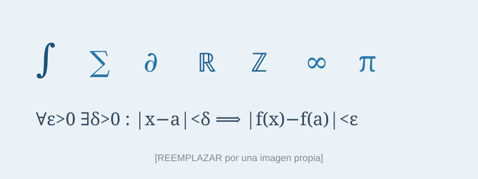

¡Hola! Esta es la primera entrada del blog. La uso para enseñar lo más básico
de cómo se escribe aquí: texto normal, una imagen, una lista y un enlace. Las
entradas siguientes ya entran en materia matemática de verdad.

## ¿Qué encontrarás en este blog?

Pienso usar este espacio para varias cosas:

- **Notas de clase** y aclaraciones para mis estudiantes.
- **Divulgación**: explicar ideas bonitas de las matemáticas sin tanto formalismo.
- **Apuntes de investigación**: comentar artículos que voy leyendo.

A veces las entradas serán cortas; otras, demostraciones completas. Por ejemplo,
en la [siguiente entrada](../teorema/index.qmd) demuestro con todo detalle que
$\sqrt{2}$ es irracional.

## ¿Por qué Quarto?

Escribir matemáticas en una web suele ser incómodo. Con esta herramienta puedo
escribir como si tomara apuntes —en texto plano con un poco de LaTeX— y el
resultado se ve limpio y profesional. Si te interesa el detalle técnico, todo
el código fuente del sitio está pensado para editarse sin ser informático.

> "Las matemáticas son el alfabeto con el cual Dios ha escrito el universo."
> — atribuido a Galileo Galilei.

¡Nos leemos en la próxima entrada!
